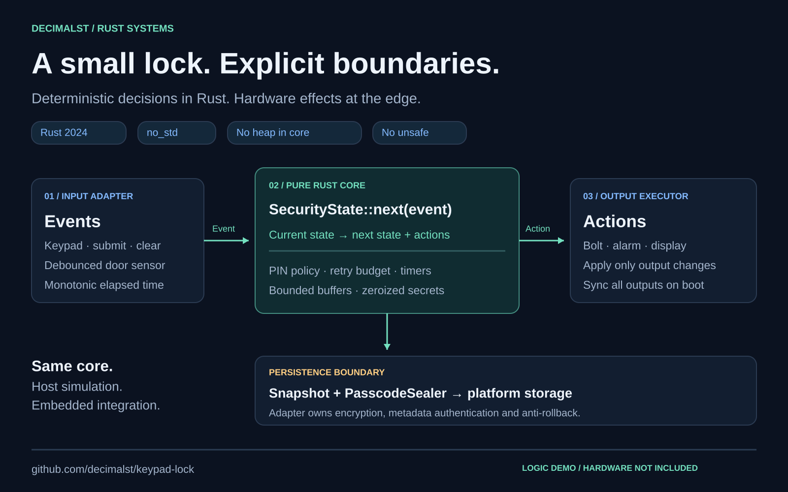
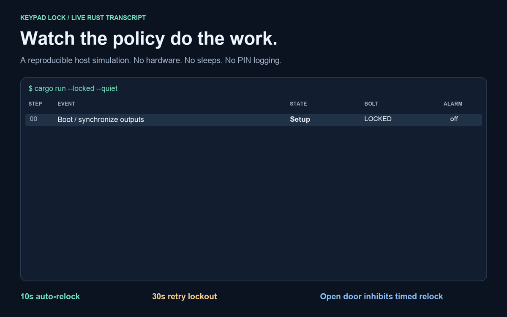

# Keypad Lock · Rust

**A deterministic lock controller with explicit hardware boundaries.**

[](https://github.com/decimalst/keypad-lock/actions/workflows/ci.yml)


[](LICENSE)

A small systems project about a consequential boundary: deciding what a lock should do, then letting a hardware adapter carry it out. The core uses bounded storage, owns its secrets, and advances only when given an event. It has no I/O, heap allocation, `unsafe`, or internal clock.



## Run the demo

Install [Rust with rustup](https://rustup.rs/), then:

```sh
git clone https://github.com/decimalst/keypad-lock.git
cd keypad-lock
cargo run --locked --quiet
```

The repository pins **Rust 1.98.1**, using the **2024 edition**. The default demo walks through enrollment, successful and failed authentication, door-aware relocking, retry lockout, and an intrusion alarm. Time advances through events, so the entire run finishes without sleeping.



The animation is rendered from the program's [tested transcript](docs/demo.txt). It is a host simulation, not footage of a physical device. [Static demo](docs/assets/demo.png) · [Architecture PNG](docs/assets/architecture.png)

## Design at a glance

```text
Current state + Event → Next state + bounded Actions
```

| Boundary | Responsibility |
| --- | --- |
| Input adapter | Debounce keys and door sensor; supply monotonic elapsed time. |
| Rust core | Validate PIN input, preserve the retry budget, enforce timers and choose desired outputs. |
| Output executor | Apply actions, detect hardware failures and synchronize outputs at startup. |
| Persistence adapter | Seal PIN bytes; authenticate the **entire** snapshot; manage keys, atomic writes and rollback protection. |

The library is `#![no_std]` and forbids unsafe code. It uses a fixed six-digit buffer and a fixed-capacity action collection. `zeroize` clears secret buffers on clear/drop; `subtle` compares digits and length without a data-dependent early exit. Input event and state debugging redact PIN digits.

Transitions emit only changed outputs plus feedback. `output_actions()` supplies a complete output set for boot or executor recovery. `mode()` provides a public, secret-free view without parsing debug output.

## Behavior

| Policy | Default |
| --- | --- |
| PIN enrollment | 3–6 digits; clear and retry after overflowing the buffer |
| Incorrect PIN | Counts as a failed attempt; an overlong guess never matches its truncated prefix |
| Retry lockout | After 3 failures; ignores keypad input for 30 seconds |
| Automatic relock | After 10 seconds, once the door is closed |
| Intrusion alarm | Opening while locked raises a 5-second alarm; preserves previous failed attempts |
| Clear | Erases the whole input, not just its last digit |
| Timers | Saturating arithmetic; no clock reads or sleeps in the core |

These are compile-time policies, not runtime configuration. The short demonstration PIN policy is preserved from the original project; it is not a recommendation for a deployed access-control system.

### Optional acoustic flow

```sh
cargo run --locked --quiet --features acoustic_unlock
cargo test --locked --all-features
```

With this feature, a correct PIN enters `PendingAudio` for up to five seconds. Every audio-frequency input is deliberately rejected and raises an alarm. There is **no working second-factor verifier**: a frequency alone is not an authenticated challenge. The feature demonstrates a denial path and timeout, not production MFA. [Feature transcript](docs/demo-acoustic.txt)

## Use the library

```rust
use keypad_lock_fsm::{Digit, Event, SecurityState};

let mut state = SecurityState::default();
let boot_actions = state.output_actions();
// Your executor applies boot_actions before accepting input.

let (next, actions) = state.next(Event::Keypress(Digit::new(1).unwrap()));
state = next;
// Your executor applies actions and handles hardware failures.
```

A pure core cannot confirm that a bolt physically moved. Execute actions in order; handle actuator errors outside the FSM. See [integration and security boundaries](docs/SECURITY.md) before connecting hardware.

### Persistence and recovery

`PasscodeSealer` is an interface, not an included cryptographic implementation. It protects only the PIN blob when backed by a suitable adapter. Mode, retry count and timing metadata need authentication too; structural validation alone cannot detect a valid-looking forged or replayed snapshot.

Use `restore_primed_with(sealer, snapshot, live_door_reading)` at boot and apply **all** returned actions before processing input. The lower-level `restore_with` treats the door as open/unknown for automatic relocking until a live closed reading arrives. Restoring a valid `Unlocked` snapshot can resume unlocked operation; this is not a blanket fail-closed reboot policy.

Snapshot format **v3** rejects old versions, restarts unfinished enrollment and preserves retry counts through alarms. If restore returns `None`, keep the device inhibited and require an authorized recovery procedure; do not silently enroll a replacement PIN. See [migration notes](CHANGELOG.md).

## Verification

```sh
cargo test --locked
cargo test --locked --all-features
cargo clippy --locked --all-targets --all-features -- -D warnings
cargo fmt --check
```

For the complete local gate, including optimized tests and embedded compilation:

```sh
rustup target add thumbv7em-none-eabihf
bash scripts/check.sh
```

Tests include exact timer boundaries, extreme durations, every byte-sized PIN length and retry count in persistence validation, output synchronization, secret redaction, overflow handling, feature-specific behavior and the executable demo. An independent policy model checks **7,776 five-operation histories per feature configuration**, including every prefix.

[Validation results and coverage scope](docs/VALIDATION.md) record measured coverage rather than equating passing tests with complete correctness. CI exercises both configurations on Linux, macOS and Windows, checks an embedded ARM target, enforces a 99% source-line coverage floor and runs the RustSec dependency audit. Scheduled runs and Dependabot help catch drift.

## Project map

```text
src/lib.rs             Pure, allocation-free lock state machine
src/main.rs            Deterministic host demo
tests/fsm.rs           Original behavior regressions
tests/regressions.rs   Boundary tests and independent policy model
tests/demo.rs          Executable behavior and transcript checks
docs/assets/           Architecture, demo images and animation
scripts/check.sh       Local quality gate
scripts/render_assets.py  Rebuild presentation assets
```

## Share or extend it

The [architecture PNG](docs/assets/architecture.png) and [demo PNG](docs/assets/demo.png) are ready to attach to a project post. A [draft LinkedIn caption](docs/LINKEDIN.md) summarizes the work without claiming hardware certification or production readiness.

To rebuild the images, install Pillow 12.3.0 in a virtual environment and run `python scripts/render_assets.py`. The script reads the tested transcript; no AI-generated hardware photographs are used. Use `--font` and `--bold-font` to supply local TrueType fonts if Arial or DejaVu Sans is unavailable.

Useful next extensions are a board-specific executor, authenticated storage with rollback protection, and hardware-in-the-loop fault testing. Those boundaries are intentionally visible so the core can be reviewed on its own.

## License

[Apache-2.0](LICENSE)
